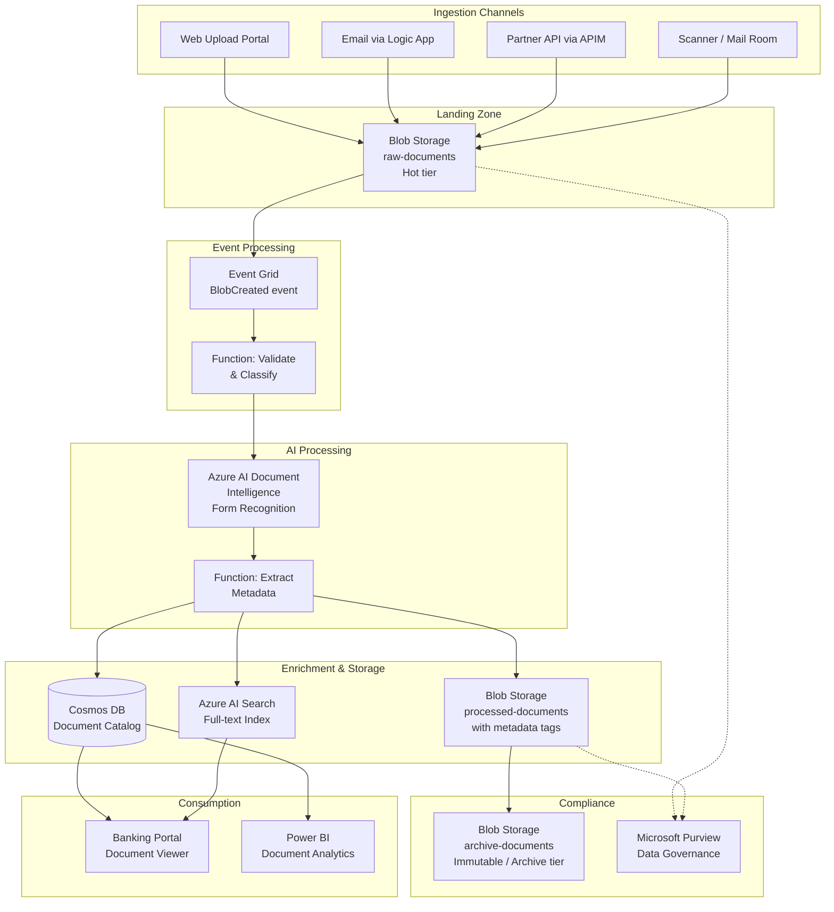

# Architecture: Document Ingestion System

> **Domain:** Banking — Document Management / Compliance
> **Pattern:** Event-driven pipeline, batch + real-time processing
> **Azure services:** Blob Storage, Event Grid, Functions, Cognitive Services, Cosmos DB, Search, Data Factory

---

## Business Context

A bank receives thousands of documents daily — loan applications, identity documents, financial statements, contracts, and compliance forms. These documents arrive via multiple channels (web upload, email, API, scanned mail) and must be:

- Ingested and stored securely
- Classified by type (identity, financial, legal)
- Extracted for key information (OCR, form recognition)
- Indexed for search
- Retained according to compliance policies
- Made available to relevant business units

---

## Architecture Diagram



## Component Details

### Ingestion Channels
| Channel | Service | Notes |
|---------|---------|-------|
| Web Upload | App Service + Blob API | Direct upload via SAS token (time-limited, write-only) |
| Email | Logic App (O365 connector) | Extracts attachments, saves to Blob with metadata |
| Partner API | APIM → Function → Blob | REST API with authentication and file validation |
| Physical Mail | Scanner software → Blob API | Scanned images uploaded to raw container |

### Processing Pipeline
| Step | Service | Purpose |
|------|---------|---------|
| 1. Event Detection | Event Grid (BlobCreated) | Triggers processing when any document lands in raw container |
| 2. Validation | Azure Function | Virus scan, file type validation, size check, duplicate detection |
| 3. Classification | Azure AI Document Intelligence | Identifies document type: ID, financial statement, contract, etc. |
| 4. Extraction | Azure AI Document Intelligence | OCR, key-value extraction, table extraction |
| 5. Metadata Enrichment | Azure Function | Adds business metadata, links to customer record |
| 6. Indexing | Azure AI Search | Full-text search index for document content |
| 7. Catalog | Cosmos DB | Document metadata, status, links, processing history |

### Storage Tiers
| Container | Tier | Retention | Immutable |
|-----------|------|-----------|-----------|
| `raw-documents` | Hot | 7 days then auto-delete | No |
| `processed-documents` | Hot (30d) → Cool (180d) | 7 years | No |
| `archive-documents` | Archive | 10 years | Yes (time-based retention) |
| `quarantine` | Hot | 30 days | No |

### Data Model (Cosmos DB)

```json
{
    "id": "DOC-2026-001234",
    "partitionKey": "CUST-56789",
    "documentType": "financial-statement",
    "classification": {
        "type": "income-statement",
        "confidence": 0.95,
        "model": "prebuilt-document"
    },
    "extractedData": {
        "totalIncome": 85000,
        "currency": "ISK",
        "period": "2025-Q4"
    },
    "metadata": {
        "fileName": "income-2025-q4.pdf",
        "fileSize": 245000,
        "mimeType": "application/pdf",
        "uploadChannel": "web",
        "uploadedBy": "customer-portal",
        "uploadedAt": "2026-03-08T10:30:00Z"
    },
    "processing": {
        "status": "completed",
        "processedAt": "2026-03-08T10:30:45Z",
        "steps": ["validated", "classified", "extracted", "indexed"]
    },
    "storage": {
        "rawBlobUri": "raw-documents/2026/03/08/DOC-2026-001234.pdf",
        "processedBlobUri": "processed-documents/CUST-56789/DOC-2026-001234.pdf"
    },
    "linkedApplications": ["LOAN-2026-00567"]
}
```

---

## Security Controls

- **Upload security:** SAS tokens are write-only, time-limited (15 minutes), scoped to the raw container
- **Virus scanning:** Every file scanned before processing; quarantine container for suspicious files
- **PII handling:** Azure AI Document Intelligence extracts PII; Purview classifies and tracks
- **Encryption:** Customer-managed keys (CMK) for storage encryption; TLS 1.2 in transit
- **Network:** Private Endpoints for all storage, Cosmos DB, and AI services
- **Access:** Managed Identities for all service-to-service calls; no shared keys in code

---

## Cost Optimization

- **Pay-per-use:** Functions on Consumption plan for unpredictable document volumes
- **Lifecycle management:** Automatic tiering saves ~60-80% on long-term storage
- **AI Services:** Process only new/modified documents; cache classification results
- **Search:** Basic tier for small document sets; Standard for production with replicas


