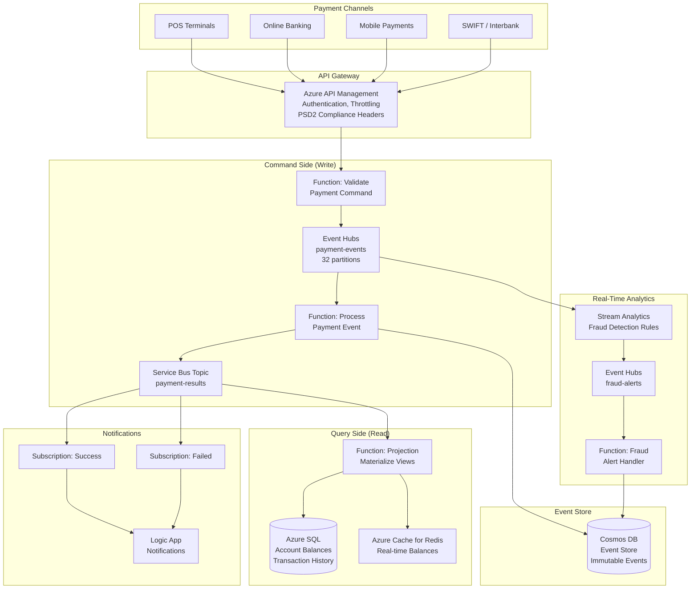

# Architecture: Event-Driven Payment Processing

> **Domain:** Banking — Payments
> **Pattern:** Event-driven, CQRS, event sourcing
> **Azure services:** Event Hubs, Functions, Service Bus, Cosmos DB, Azure SQL, APIM, Key Vault

---

## Business Context

A bank processes millions of payment transactions daily — card payments, wire transfers, direct debits, and instant payments. The system must:

- Process payments with sub-second latency
- Detect fraudulent transactions in real-time
- Maintain an immutable audit trail of all events
- Support high throughput (thousands of transactions per second)
- Ensure exactly-once processing for financial integrity
- Comply with PSD2 and local payment regulations

---

## Architecture Diagram



## CQRS Pattern Explained

This architecture uses **Command Query Responsibility Segregation (CQRS)**:

| Side | Responsibility | Optimized For |
|------|---------------|---------------|
| **Command (Write)** | Accept, validate, and process payment commands | High throughput, durability |
| **Query (Read)** | Serve account balances, transaction history | Low latency, flexible querying |
| **Event Store** | Immutable log of all payment events | Audit, replay, debugging |

**Why CQRS for payments?**
- Write and read workloads have very different performance profiles
- The event store provides a complete audit trail (regulatory requirement)
- Read models can be rebuilt from events (disaster recovery)
- Multiple read models can serve different use cases (mobile app, analytics, compliance)

---

## Component Details

### Event Hubs Configuration
| Setting | Value | Reason |
|---------|-------|--------|
| Partitions | 32 | High throughput, parallel processing |
| Partition key | `accountId` | Co-located events per account for ordering |
| Retention | 7 days | Replay window for reprocessing |
| Capture | Enabled → Data Lake | Long-term event storage for analytics |
| Throughput | 20 TU (auto-inflate to 40) | Handle peak loads (e.g., salary day) |

### Cosmos DB Event Store
```json
{
    "id": "EVT-2026-0308-001234",
    "partitionKey": "ACCT-12345",
    "eventType": "PaymentProcessed",
    "timestamp": "2026-03-08T14:22:03.456Z",
    "version": 1,
    "data": {
        "transactionId": "TXN-2026-0308-001234",
        "fromAccount": "ACCT-12345",
        "toAccount": "ACCT-67890",
        "amount": 15000,
        "currency": "ISK",
        "type": "transfer",
        "status": "completed"
    },
    "metadata": {
        "correlationId": "CORR-abc123",
        "source": "online-banking",
        "processedBy": "func-payment-processor",
        "fraudScore": 0.02
    }
}
```

### Stream Analytics Fraud Detection

```sql
-- Flag transactions that exceed 3x the customer's average amount
WITH AverageAmounts AS (
    SELECT
        data.fromAccount AS accountId,
        AVG(data.amount) AS avgAmount
    FROM paymentEvents TIMESTAMP BY timestamp
    GROUP BY
        data.fromAccount,
        TumblingWindow(hour, 24)
)
SELECT
    p.data.transactionId,
    p.data.fromAccount,
    p.data.amount,
    a.avgAmount,
    p.data.amount / a.avgAmount AS anomalyRatio
INTO fraudAlerts
FROM paymentEvents p TIMESTAMP BY p.timestamp
JOIN AverageAmounts a ON p.data.fromAccount = a.accountId
WHERE p.data.amount > (a.avgAmount * 3)
```

---

## Scalability Design

| Component | Baseline | Peak | Scaling Strategy |
|-----------|----------|------|-----------------|
| APIM | Standard | Premium | Auto-scale units |
| Event Hubs | 20 TU | 40 TU | Auto-inflate |
| Functions (Process) | 5 instances | 50 instances | Premium plan, auto-scale on Event Hub lag |
| Cosmos DB | 10,000 RU/s | 50,000 RU/s | Auto-scale |
| SQL | 4 vCores | 16 vCores | Manual scale-up for peak periods |
| Redis | Standard C2 | Premium P2 | Scale up for peak |

---

## Security & Compliance

- **PSD2 compliance:** Strong Customer Authentication (SCA) enforced at APIM layer
- **Encryption:** All data encrypted at rest (AES-256) and in transit (TLS 1.2+)
- **Immutable audit:** Cosmos DB events with TTL = -1 (never expire); immutable storage for Event Hub Capture
- **Network isolation:** All services behind Private Endpoints; APIM in VNet
- **Fraud monitoring:** Real-time Stream Analytics + ML-based scoring
- **Key management:** All secrets in Key Vault; certificates for inter-service communication

---

## Disaster Recovery

| Component | Strategy | RPO | RTO |
|-----------|----------|-----|-----|
| APIM | Multi-region deployment | 0 | ~0 (active-active) |
| Event Hubs | Geo-DR pairing | ~0 | Minutes |
| Cosmos DB | Multi-region writes | 0 | 0 (active-active) |
| SQL | Auto-failover group | ~5s | ~30s |
| Functions | Deploy to both regions | N/A | ~0 (with Front Door) |
| Redis | Geo-replication | ~seconds | Minutes |


