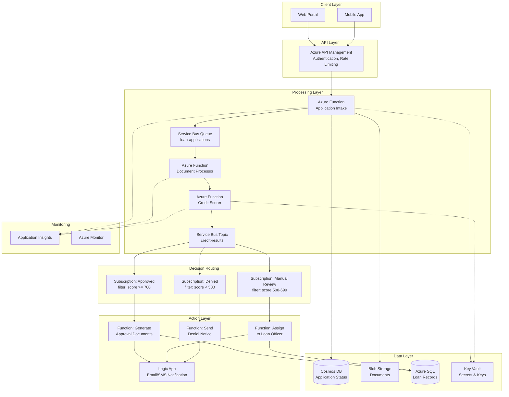

# Loan Application Processing System

| | |
|---|---|
| **Domain** | Banking — Lending |
| **Pattern** | Event-driven, asynchronous processing pipeline |
| **Azure Services** | APIM, Functions, Service Bus, Cosmos DB, Blob Storage, Key Vault, Application Insights |
| **Status** | Reference architecture |

---

## Executive Summary

This design replaces a paper-based loan application workflow with an event-driven processing pipeline on Azure. Applications arrive through web and mobile channels, flow through automated credit scoring, and are routed to approval, manual review, or denial — all asynchronously, with a full audit trail for regulatory compliance.

**Key outcomes:**
- Application processing time reduced from days to minutes (for auto-approved loans)
- Zero stored credentials — all service-to-service auth via Managed Identity
- RPO 5 seconds / RTO 15 minutes through geo-replicated SQL and automated failover
- Immutable audit logs satisfy FME (Financial Supervisory Authority) requirements

---

## Business Context

A bank needs to digitize its loan application process. Currently, loan officers manually collect documents, run credit checks, and send paper-based approvals. The new system must:

- Accept loan applications via a web portal and mobile app
- Validate and process documents asynchronously
- Run automated credit scoring
- Route decisions (approve/deny/manual review) based on rules
- Notify applicants of status changes
- Maintain a full audit trail for regulatory compliance

---

## Architecture Diagram

## Component Details

### API Layer
| Component | Service | Purpose |
|-----------|---------|---------|
| API Gateway | Azure API Management (Standard) | Single entry point, JWT auth via Entra ID, rate limiting (100 req/min per partner), request validation |
| Authentication | Entra ID + APIM Policy | OAuth 2.0 token validation, partner API keys |

### Processing Layer
| Component | Service | Purpose |
|-----------|---------|---------|
| Application Intake | Azure Function (HTTP trigger, Premium plan) | Validates input, stores documents, creates application record |
| Document Processor | Azure Function (Service Bus trigger) | Extracts metadata, virus scanning, OCR for scanned documents |
| Credit Scorer | Azure Function (Service Bus trigger) | Calls credit bureau API, calculates risk score |

### Messaging
| Component | Service | Configuration |
|-----------|---------|---------------|
| Application Queue | Service Bus Queue | Max delivery: 5, TTL: 7 days, duplicate detection: 10 min, sessions enabled (per applicant) |
| Credit Results | Service Bus Topic | 3 subscriptions with SQL filters on score ranges |

### Data Layer
| Component | Service | Purpose |
|-----------|---------|---------|
| Application Status | Cosmos DB (Session consistency) | Real-time status lookups, partition key: `applicationId` |
| Documents | Blob Storage (RA-GZRS) | Loan documents, lifecycle: Hot → Cool (30d) → Archive (180d) |
| Loan Records | Azure SQL (Business Critical) | Structured loan data, geo-replication for DR |
| Secrets | Key Vault | API keys for credit bureau, database connection strings |

### Monitoring
| Component | Service | Alerts |
|-----------|---------|--------|
| APM | Application Insights | Response time > 3s, error rate > 5%, DLQ messages > 0 |
| Infrastructure | Azure Monitor | CPU > 80%, memory > 85%, Service Bus queue depth > 1000 |

---

## Security Controls

- **Network:** All PaaS services behind Private Endpoints; APIM in internal VNet mode (Premium)
- **Identity:** Managed Identities for all service-to-service communication; no stored credentials
- **Data:** TDE on SQL; encryption at rest on Blob and Cosmos DB; TLS 1.2 in transit
- **Access:** RBAC with least privilege; PIM for admin roles
- **Compliance:** Immutable audit logs in Blob Storage; SQL auditing to Log Analytics

---

## Scalability

- **APIM:** Auto-scales on Consumption plan; Premium for high-volume production
- **Functions:** Premium plan with min 2 instances for low-latency; auto-scale to 20 instances
- **Service Bus:** Premium tier with 1 messaging unit; scale up for throughput
- **Cosmos DB:** Auto-scale RU/s from 400 to 4000 based on demand
- **SQL:** vCore auto-scaling or elastic pool for multiple databases

---

## Disaster Recovery

- **RPO:** 5 seconds (SQL async geo-replication)
- **RTO:** 15 minutes (automated failover for SQL; Traffic Manager for compute)
- **Strategy:** Active-Passive with automated failover
- **DR Region:** West Europe (paired region for North Europe)

---

## Alternatives Considered

| Decision Point | Chosen | Alternative | Why Not |
|---------------|--------|-------------|---------|
| Messaging broker | Service Bus | Event Grid | Need guaranteed delivery, ordering, dead-letter, and message sessions for per-applicant FIFO |
| Decision routing | Topic + SQL filters | Function with if/else logic | Declarative filters are auditable and changeable without code deploy |
| Document store | Blob Storage (RA-GZRS) | SharePoint / OneDrive | Need lifecycle management, immutable storage for compliance, programmatic access |
| Status database | Cosmos DB (Session consistency) | Azure SQL | Sub-10ms point reads by `applicationId`; schema flexibility for evolving application fields |
| Structured records | Azure SQL (Business Critical) | Cosmos DB | Relational data with joins (loan + applicant + guarantor); built-in auditing; regulatory familiarity |
| Compute model | Azure Functions (Premium) | Container Apps | Functions integrate natively with Service Bus triggers; Premium plan meets cold-start requirements |

---

## Cost Estimate (Monthly, North Europe)

| Component | SKU | Estimated Cost |
|-----------|-----|----------------|
| APIM | Standard (1 unit) | ~€120 |
| Functions | Premium EP1 (2 instances) | ~€230 |
| Service Bus | Premium (1 MU) | ~€560 |
| Cosmos DB | Autoscale 400–4000 RU/s | ~€45–€180 |
| Azure SQL | Business Critical 2 vCores | ~€350 |
| Blob Storage | RA-GZRS, 100 GB | ~€5 |
| Key Vault | Standard | ~€3 |
| App Insights + Log Analytics | 5 GB/day | ~€10 |
| **Total** | | **~€1,300–€1,460** |

> Estimates based on Azure pricing calculator (2024). Production costs depend on volume.

---

## Lessons & Recommendations

1. **Start with Service Bus Premium** if you need message sessions — Standard tier lacks this feature and migration is disruptive.
2. **Use dead-letter alerts from day one** — a DLQ message means a loan application is stuck. Alert at depth > 0.
3. **Version your message schemas** — add a `schemaVersion` field to Service Bus messages so consumers can handle old and new formats.
4. **Test failover quarterly** — DR looks good on paper; run a real failover drill to West Europe every quarter.
