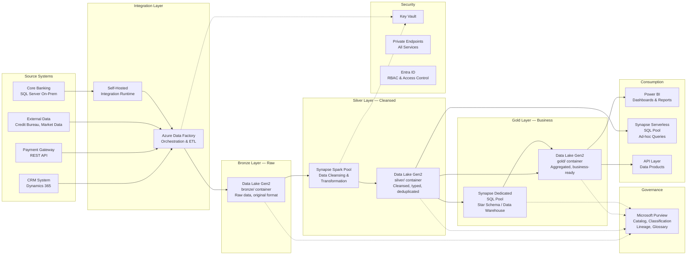
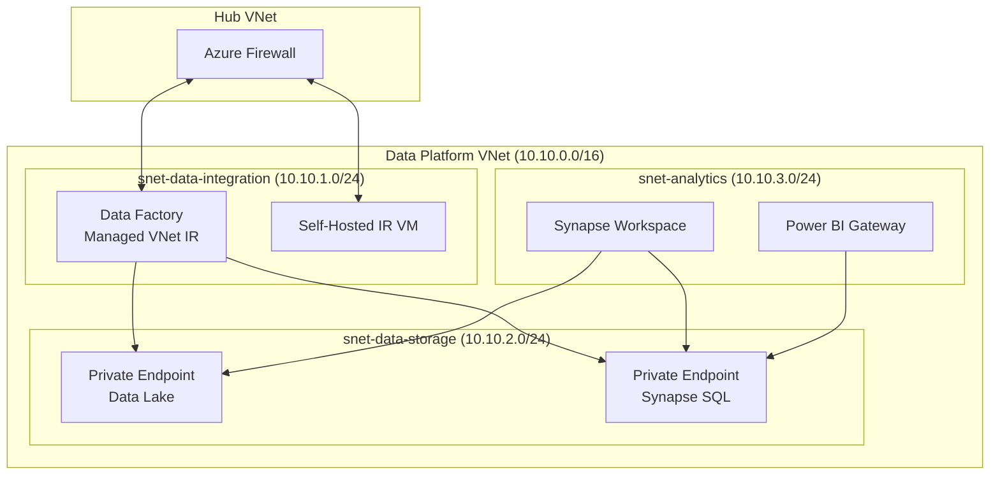

# Architecture: Secure Data Pipeline

> **Domain:** Banking — Data & Analytics / Compliance
> **Pattern:** Medallion architecture (Bronze/Silver/Gold), ETL/ELT
> **Azure services:** Data Factory, Data Lake Storage Gen2, Synapse Analytics, Purview, Key Vault, Private Endpoints

---

## Business Context

A bank needs a centralized data platform that:

- Ingests data from multiple source systems (core banking, CRM, payments, external feeds)
- Transforms and cleanses data for analytics and regulatory reporting
- Enforces data governance (classification, lineage, access control)
- Meets strict security requirements (encryption, network isolation, auditability)
- Enables self-service analytics for business users while protecting sensitive data

---

## Architecture Diagram



## Medallion Architecture

| Layer | Container | Purpose | Format | Retention |
|-------|-----------|---------|--------|-----------|
| **Bronze** | `bronze/` | Raw data exactly as received from source | JSON, CSV, Parquet, XML | 2 years |
| **Silver** | `silver/` | Cleansed, typed, deduplicated, standardized | Delta / Parquet | 5 years |
| **Gold** | `gold/` | Business-ready aggregations, KPIs, report-ready | Delta / Parquet | 7 years |

### Bronze → Silver Transformations
- Schema validation and type casting
- Null handling and default values
- Deduplication based on business keys
- PII masking for non-privileged consumers
- Standardize date formats, currencies, codes

### Silver → Gold Transformations
- Business logic aggregations (daily balances, monthly totals)
- Star schema dimensional modeling
- KPI calculations (NPL ratio, loan-to-value, risk scores)
- Regulatory report datasets (COREP, FINREP, local reporting)

---

## Data Factory Pipeline Design

```
Master Pipeline (scheduled daily at 02:00 UTC)
├── 1. Ingest Pipeline
│   ├── CBS → Bronze (via Self-Hosted IR, incremental CDC)
│   ├── CRM → Bronze (via REST connector, delta query)
│   ├── Payments → Bronze (via REST connector, date filter)
│   └── External → Bronze (via HTTP connector)
│
├── 2. Transform Pipeline
│   ├── Bronze → Silver (Synapse Spark notebook)
│   ├── Data quality checks (row counts, null checks, schema validation)
│   └── PII classification scan (Purview)
│
├── 3. Load Pipeline
│   ├── Silver → Gold (Synapse SQL stored procedures)
│   ├── Gold → Synapse DW (CTAS / MERGE operations)
│   └── Refresh Power BI datasets
│
└── 4. Governance Pipeline
    ├── Update Purview lineage
    ├── Run data quality report
    └── Send pipeline status notification
```

---

## Security Design

### Network Isolation



### Access Control Matrix

| Role | Bronze | Silver | Gold | Synapse DW |
|------|--------|--------|------|------------|
| Data Engineer | Read/Write | Read/Write | Read | Full Access |
| Data Analyst | No Access | Read (masked PII) | Read | Read |
| Business User | No Access | No Access | No Access | Read (via Power BI) |
| Compliance Officer | Read | Read | Read | Read |
| Data Factory MI | Read/Write | Read/Write | Read/Write | Write |

### Data Protection

- **Encryption at rest:** Customer-managed keys (CMK) via Key Vault for Data Lake and Synapse
- **Encryption in transit:** TLS 1.2 enforced on all connections
- **PII masking:** Dynamic data masking in Synapse SQL; column-level security for sensitive fields
- **Row-level security:** Users see only their department's data in Power BI
- **Audit logging:** All data access logged to Log Analytics; Data Factory pipeline runs tracked

---

## Data Governance with Purview

| Capability | Implementation |
|------------|---------------|
| **Data Catalog** | Automatic scanning of Data Lake, Synapse, and SQL sources |
| **Classification** | Built-in classifiers for PII (names, IDs, credit card numbers) |
| **Lineage** | Auto-captured from Data Factory pipelines and Synapse notebooks |
| **Glossary** | Business terms defined (e.g., "Net Loan Balance", "Non-Performing Loan") |
| **Access Policies** | Purview controls who can read/deny specific data assets |

---

## Cost Optimization

| Strategy | Savings |
|----------|---------|
| Synapse serverless for ad-hoc (vs. always-on dedicated pool) | ~70% for exploratory queries |
| Data Lake lifecycle management (Hot → Cool → Archive) | ~60% on storage after 1 year |
| ADF pipeline scheduling (off-peak hours, batch) | Reduced integration runtime costs |
| Synapse auto-pause on dedicated pool (dev/test) | ~80% when not in use |
| Reserved capacity for Synapse (1-year) | ~40% discount |


