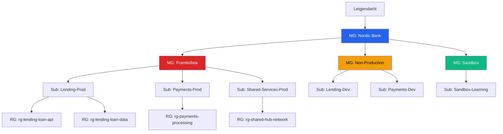

# Kerfishönnun: Skipulag Azure auðlinda í banka

> **Vika:** 1 | **Dagsetning:** 13.3.2026 | **Tengt námsefni:** 01 — Azure Fundamentals

---

Í þessari æfingu gerum við ráð fyrir þremur kjarnasviðum hjá bankanum: Lending, Payments og Internal Channels.

## Viðskiptasamhengi

Nordic Bank vinnur með þrjú kjarnateymi: **Lending**, **Payments** og **Internal Channels**. Hvert kjarnateymi er með sín eigin þróunarteymi en öll deila sama ramma fyrir öryggi og stjórnun. Þegar bankinn flytur fleiri vinnslur yfir í Azure þurfum við skýrt skipulag á auðlindum sem tryggir gott utanumhald og regluvörslu, án þess að tefja teymi í daglegri vinnu.

---

## Kröfur

| Tegund | Krafa |
|------|-------------|
| Virkni | Hver deild getur dreift lausnum sjálfstætt innan skýrra varna (guardrails). |
| Reglur | Reglur (policies) eiga að erfast sjálfkrafa án handvirkrar uppsetningar í hverri áskrift. |
| Samræmi | Allar auðlindir verða að vera merktar með eiganda, kostnaðarstað og gagnaflokkun. |
| Kostnaðartakmörkun | Dev/Test umhverfi eiga að hafa aðskilda fjárhagsáætlun frá production. |

---

## Arkitektúrmynd

---

## Úthlutun policies eftir umfangi

| Umfang | Reglur |
|-------|-----------------|
| **MG: Nordic Bank** | Krefjast tags (owner, cost-center, data-classification). Audita ódulkóðaða geymslu. Banna stofnun á public IP. |
| **MG: Framleiðsla** | Leyfilegar staðsetningar: North Europe, West Europe. Krefjast zone-redundancy. Banna B-series VM. |
| **MG: Non-Production** | Budget viðvörun á $500/mán. Leyfilegar VM stærðir: B-series eingöngu. Sjálfvirk lokun VM kl. 19:00. |
| **MG: Sandbox** | Budget viðvörun á $100/mán. Allar reglur frá rót en mildari takmarkanir á VM stærðum. |

---

## Ákvarðanir um íhluti

| Íhlutur | Val | Ástæða | Valkostur sem var metinn |
|-----------|--------|-----|----------------------|
| Efsta flokkun | Management Groups | Erfðir á policies og sköpun RBAC | Policies bara á subscription stigi — skalar illa |
| Prod vs Non-Prod | Aðskildar MG greinar | Ólíkar kostnaðar- og samræmiskröfur | Sama MG með skilyrtum policies — erfiðara að audita |
| Sameiginlegar þjónustur | Sérstök subscription | Hub-spoke net, sameiginlegt DNS | Sameiginlegar auðlindir í hverri deild — eykur tvítekningu |

---

## Málamiðlanir og rök

- **Fleiri subscriptions = meiri einangrun** en einnig meiri rekstrarflækja. Við samþykkjum það þar sem bankaumhverfi krefst skýrra marka milli production og non-production.
- **Management Groups auka flækjustig** en gefa okkur policy-erfðir. Án þeirra þyrftum við að setja sömu policies handvirkt á hverja subscription.
- **Sandbox subscription** gerir tilraunir mögulegar án áhættu fyrir production-governance.

Í þessari hönnun er kostnaði forgangsraðað eftir áhættu og mikilvægi þjónustu. Production fær meiri vernd og strangari kröfur þó rekstrarkostnaður verði hærri. Non-production notar ódýrari stærðir, budget-viðvaranir og sjálfvirka lokun til að halda kostnaði niðri. Sandbox er með lægstu fjárhagsáætlunina svo teymi geti prófað hratt án óvænts kostnaðar.

---

## Það sem ég lærði
- Mikilvægt er að skrá stjórnun og ábyrgðir skýrt í stóru Azure umhverfi.
- Management Groups, subscriptions og policies hjálpa að halda utan um aðgang, öryggi og samræmi.
- Tags og budget controls gera kostnað og ábyrgð sýnilegri milli teyma.
- Skýr skipting á production og non-production minnkar áhættu og einfaldar eftirfylgni.
