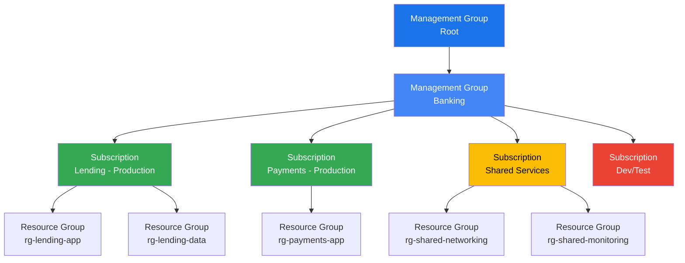
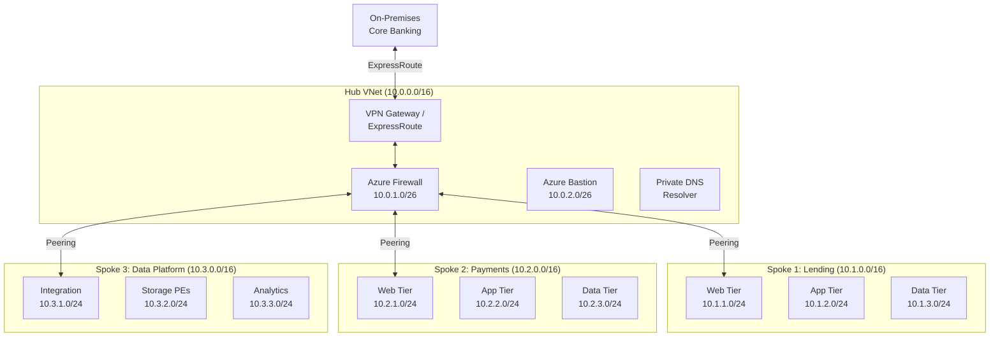
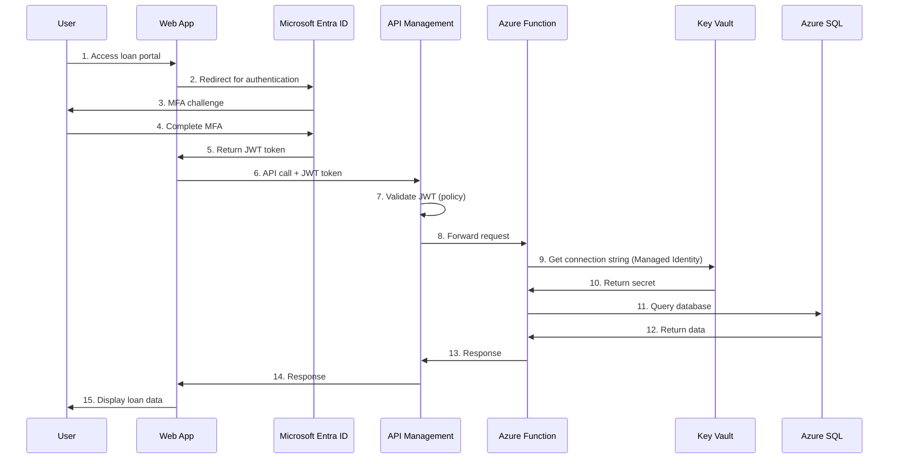
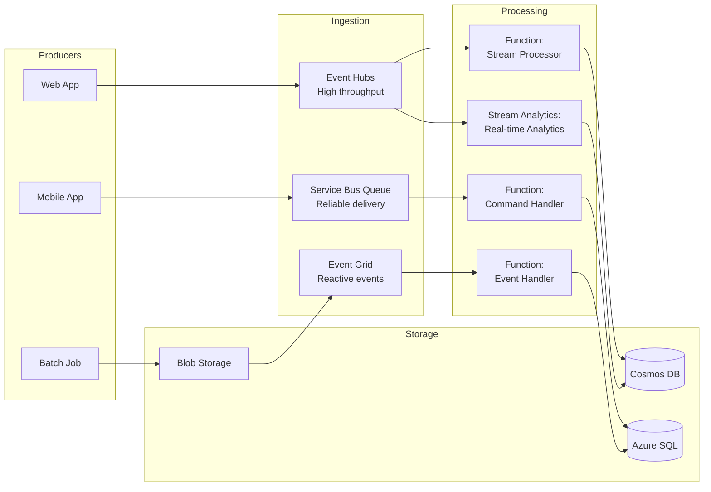
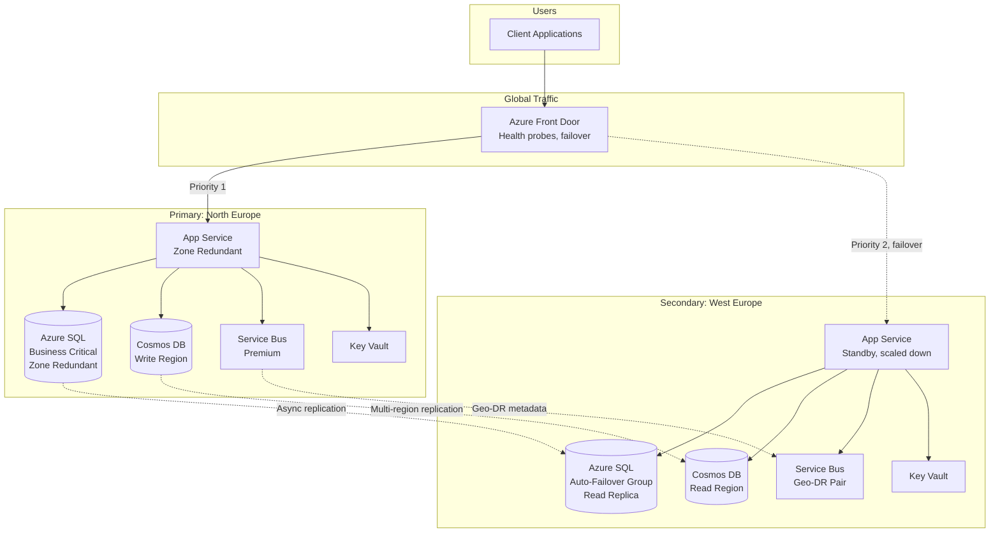
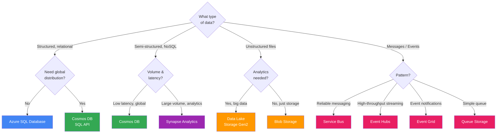
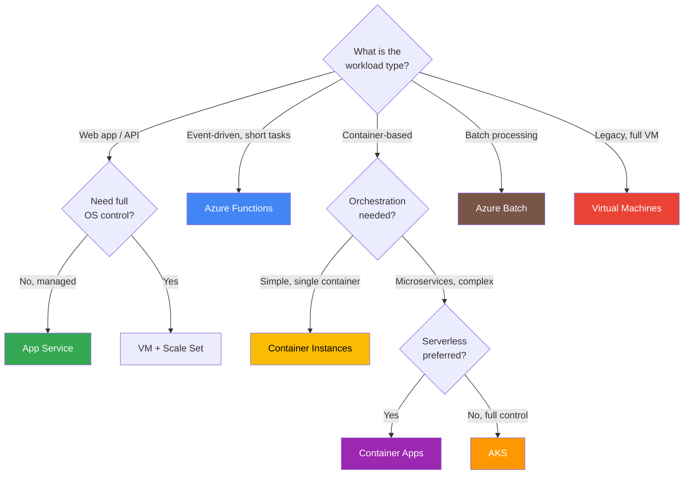

# Mermaid Diagrams — Azure Architecture Reference

> Use these diagrams in VS Code with the Mermaid preview extension, or paste into any Mermaid-compatible renderer.

---

## 1. Azure Resource Hierarchy

---

## 2. Hub-Spoke Network Topology

---

## 3. Identity and Access Flow

---

## 4. Event-Driven Architecture Pattern

---

## 5. Multi-Region Disaster Recovery

---

## 6. Storage Decision Tree

---

## 7. Compute Decision Tree

---

## How to Preview Mermaid Diagrams in VS Code

1. Install the **"Markdown Preview Mermaid Support"** extension in VS Code
2. Open this file and press `Ctrl+Shift+V` to preview
3. Mermaid diagrams will render inline in the markdown preview

Alternatively, paste diagrams into [mermaid.live](https://mermaid.live) for an interactive editor.
