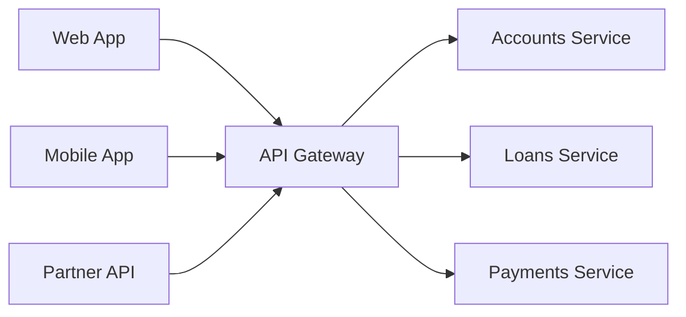
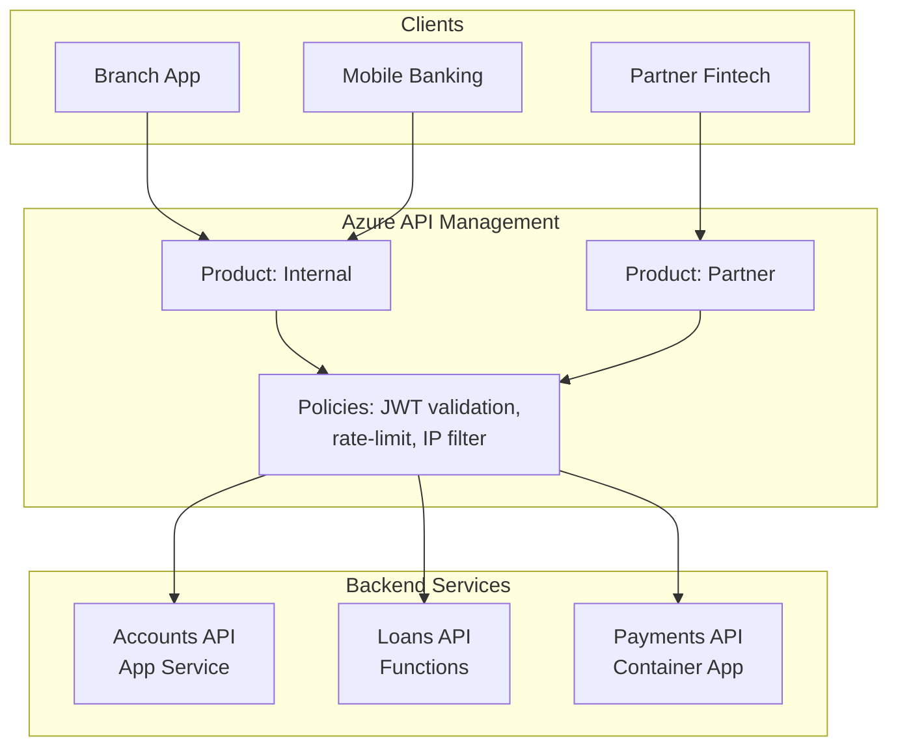

# API Gateway Pattern

> **When to use:** Multiple backend services need a unified, secure, and managed entry point for external or internal consumers.

---

## Pattern Overview

An API Gateway sits between clients and backend services, providing cross-cutting concerns: authentication, rate limiting, request transformation, and routing.

## Azure Implementation — API Management (APIM)

| APIM Feature | Purpose |
|-------------|---------|
| **Products** | Group APIs with access policies (e.g., "Internal", "Partner") |
| **Policies** | Inbound/outbound/on-error XML pipeline for transforms, caching, rate-limit |
| **Named values** | Centralize configuration; reference Key Vault secrets |
| **Subscriptions** | API keys per consumer; track usage |
| **Backends** | Define backend URLs with circuit breaker and load balancing |
| **Versions & revisions** | Non-breaking changes (revisions) vs breaking changes (versions) |

## Banking Example — Core Banking API Facade

**Why APIM here?**
- Branch and mobile apps share the same backend APIs with the same policies
- Partner access gets stricter rate limits, IP filtering, and different product grouping
- JWT validation in APIM offloads auth from every backend service
- Revision system allows updating APIs without downtime

## Key Design Decisions

| Decision | Choice | Why |
|----------|--------|-----|
| APIM tier | Premium (or Developer for study) | VNet integration needed for private backends |
| Auth | OAuth2 + JWT validation policy | Entra ID tokens validated at the gateway |
| Backend protocol | HTTPS with managed identity | No credentials in APIM config; Key Vault for secrets |
| Versioning | URL path (`/v1/`, `/v2/`) | Simplest for partners; header-based adds complexity |

## Anti-Patterns to Avoid

- **Gateway as business logic** — Keep policies thin; don't put domain logic in XML transforms.
- **Single monolith behind the gateway** — The gateway pattern assumes multiple backend services.
- **No caching strategy** — Use APIM response caching for read-heavy, slowly-changing endpoints.
- **Exposing internal errors** — Use `on-error` policies to return safe error responses.
