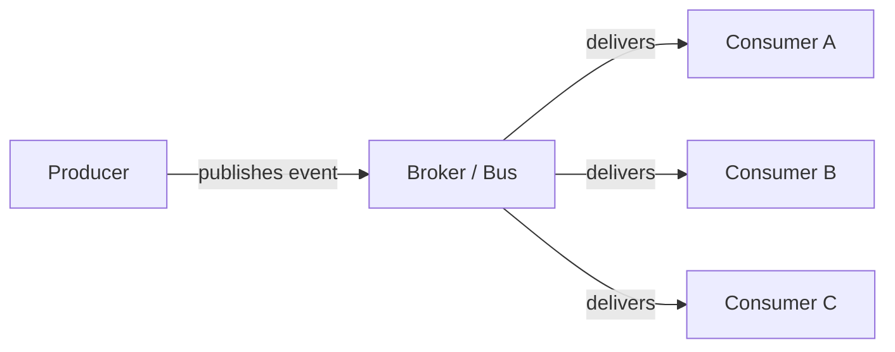
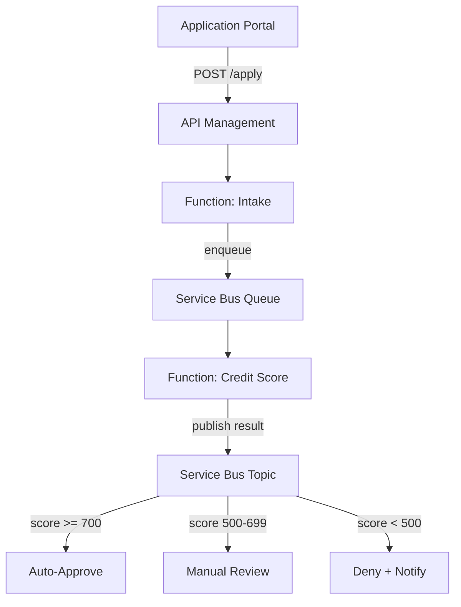

# Event-Driven Architecture

> **When to use:** Decoupled, asynchronous workflows where producers and consumers scale independently.

---

## Pattern Overview

Event-driven architecture replaces synchronous request-response chains with asynchronous message passing. Services publish events when state changes; other services react without tight coupling.

## Azure Services

| Service | Role | Best For |
|---------|------|----------|
| **Event Grid** | Reactive event routing | Resource events, lightweight pub/sub |
| **Event Hubs** | High-throughput streaming | Telemetry, clickstreams, IoT |
| **Service Bus** | Enterprise messaging | Ordered delivery, transactions, dead-letter |
| **Storage Queues** | Simple queuing | Basic decoupling, millions of messages |

## Banking Example — Loan Application Pipeline

**Why event-driven here?**
- Credit scoring takes seconds — the applicant shouldn't wait
- Each stage (intake, scoring, routing) scales independently
- Dead-letter queues catch failures without losing applications
- Topic subscriptions with filters route decisions without if/else code

## Key Design Decisions

| Decision | Choice | Why |
|----------|--------|-----|
| Broker | Service Bus (not Event Grid) | Need guaranteed delivery, ordering, and dead-letter |
| Topology | Topic with filtered subscriptions | Cleaner than queue-per-outcome; filters are declarative |
| Idempotency | Deduplicate on application ID | Service Bus supports duplicate detection natively |
| Poison messages | Dead-letter after 3 retries | Prevents infinite retry loops; alerts via Log Analytics |

## Anti-Patterns to Avoid

- **Event storm** — Publishing too many fine-grained events. Aggregate into meaningful domain events.
- **Synchronous over async** — Wrapping async messaging in a blocking HTTP call defeats the purpose.
- **Missing dead-letter handling** — Always configure dead-letter queues and alert on depth.
- **No schema evolution** — Version your event payloads; consumers must tolerate unknown fields.
