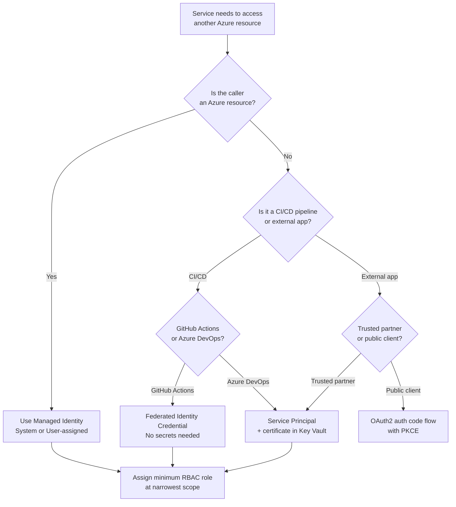
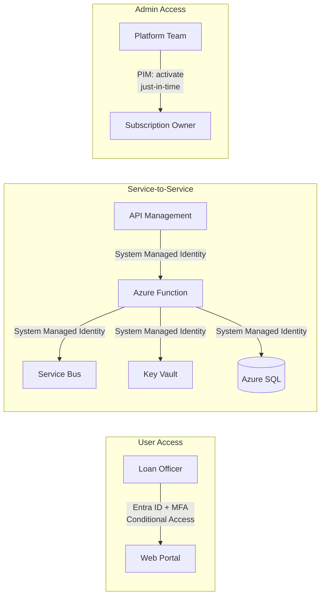

# Identity & Authentication Decisions

> **When to use:** Every Azure architecture needs identity decisions — who (or what) authenticates and how access is authorized.

---

## Identity Building Blocks

| Concept | What It Is | When to Use |
|---------|-----------|-------------|
| **Entra ID (Azure AD)** | Cloud identity provider | Always — foundational for Azure |
| **Managed Identity** | Auto-managed service principal for Azure resources | Service-to-service auth (Functions → Key Vault, App Service → SQL) |
| **Service Principal** | App registration identity | External apps or CI/CD pipelines accessing Azure |
| **RBAC** | Role-based access control | Authorization — who can do what on which scope |
| **Conditional Access** | Policy-based access rules | MFA, device compliance, location-based restrictions |
| **PIM** | Privileged Identity Management | Just-in-time elevation for admin roles |

## Decision Flowchart — Service Authentication

## Banking Example — Loan System Identity Map

**Identity decisions for this system:**
- **Loan officers**: Entra ID with Conditional Access (MFA required, compliant device, Iceland location)
- **Functions → Service Bus/SQL/Key Vault**: System-assigned Managed Identity — zero secrets stored
- **APIM → Functions**: Managed Identity with RBAC instead of function keys
- **Admins**: PIM for just-in-time Owner activation (max 4 hours, requires justification)

## RBAC Best Practices

| Principle | Implementation |
|-----------|---------------|
| **Least privilege** | Assign the narrowest built-in role (e.g., "Storage Blob Data Reader" not "Contributor") |
| **Scope narrowly** | Assign at resource group or resource level, not subscription |
| **Prefer groups** | Assign roles to Entra ID groups, not individual users |
| **Audit regularly** | Use Access Reviews in PIM for privileged roles |
| **Deny assignments** | Use Azure Policy deny effects rather than RBAC deny |

## Managed Identity: System vs User-Assigned

| Aspect | System-Assigned | User-Assigned |
|--------|----------------|---------------|
| Lifecycle | Tied to the resource | Independent — you manage it |
| Sharing | 1:1 with resource | Many resources can share one identity |
| Best for | Simple cases — one resource, one identity | Multiple resources needing same permissions |
| Example | Function → Key Vault | 5 Functions + 2 App Services → same SQL database |

## Anti-Patterns to Avoid

- **Storing secrets in app settings** — Use Managed Identity + Key Vault References instead.
- **Shared service principal for everything** — Use separate identities per service with least-privilege RBAC.
- **Subscription-level Contributor** — Too broad; always scope to resource group or resource.
- **Skipping Conditional Access** — Even internal apps should require MFA and device compliance.
- **No PIM for admins** — Standing admin access is a compliance risk; use just-in-time elevation.
