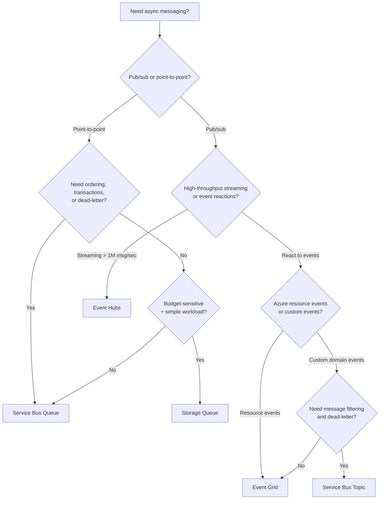

# Messaging Decision Guide

> **When to use:** You need asynchronous communication and must choose the right Azure messaging service.

---

## Decision Matrix

| Criteria | Storage Queues | Service Bus Queues | Service Bus Topics | Event Grid | Event Hubs |
|----------|---------------|-------------------|-------------------|------------|------------|
| **Message size** | 64 KB | 256 KB (Standard) / 100 MB (Premium) | Same as SB Queues | 1 MB | 1 MB (Standard) / 20 MB (Premium) |
| **Ordering** | No | FIFO (sessions) | FIFO (sessions) | No | Per partition |
| **Delivery** | At-least-once | At-least-once / At-most-once (peek-lock) | Same as SB Queues | At-least-once | At-least-once |
| **Dead-letter** | No | Yes | Yes | Yes | No (consumer manages) |
| **Transactions** | No | Yes | Yes | No | No |
| **Throughput** | ~2K msg/sec | ~2K msg/sec per unit | Same | Millions/sec | Millions/sec |
| **Consumer model** | Competing consumers | Competing consumers | Pub/sub with filters | Push (webhook/Function) | Consumer groups (pull) |
| **Cost** | Lowest | Medium | Medium | Pay per event | TU/PU based |

## Decision Flowchart

## Banking Scenarios Mapped

| Scenario | Best Fit | Reason |
|----------|----------|--------|
| Loan application queue | **Service Bus Queue** | Needs ordering (sessions), dead-letter, guaranteed processing |
| Credit decision routing | **Service Bus Topic** | Fan-out to approve/review/deny subscriptions with SQL filters |
| Account balance change notification | **Event Grid** | Lightweight event, many subscribers, push model |
| Real-time transaction feed | **Event Hubs** | High throughput, partition-based ordering, replay |
| Nightly batch file trigger | **Event Grid** (Blob events) | React to blob creation, trigger Data Factory or Function |
| Simple task queue for reports | **Storage Queue** | Low cost, no ordering needed, fire-and-forget |

## Key Takeaways

1. **Start with Service Bus** when you need enterprise messaging guarantees (ordering, transactions, dead-letter).
2. **Use Event Grid** for reactive, event-driven glue between Azure services.
3. **Use Event Hubs** only for true streaming scenarios (millions of events/sec, replay needed).
4. **Storage Queues** are the cheapest option when you need nothing more than basic queuing.
5. **Combine services** — e.g., Event Grid triggers a Function that enqueues into Service Bus.
