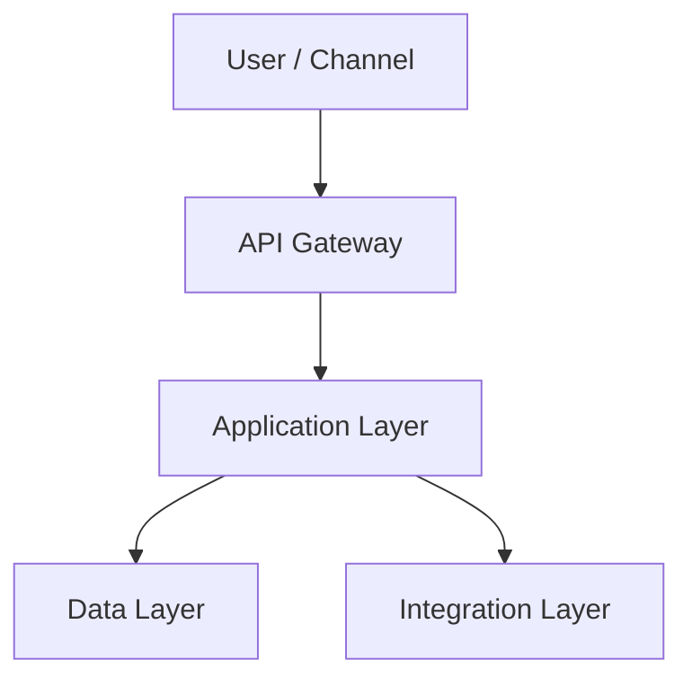

# [System Name]

| | |
|---|---|
| **Domain** | Banking — [Lending / Payments / Compliance / Operations] |
| **Pattern** | [Event-driven / CQRS / ETL pipeline / Hub-spoke / ...] |
| **Azure Services** | [List 3–5 key services] |
| **Status** | Draft / Reference architecture |

---

## Business Problem

*What banking or enterprise process does this system address? What is broken, slow, or manual today? Who is affected?*

## Requirements

| Category | Requirement |
|----------|-------------|
| **Functional** | |
| **Performance** | |
| **Availability** | SLA target: 99._% |
| **Security** | |
| **Compliance** | |

## Constraints

*What limits the design? Budget, regulations, existing systems, team skills, timeline, vendor lock-in tolerance.*

- 
- 
- 

## Architecture Overview

*Describe the system at a high level. What are the major components and how do they interact?*

### Architecture Diagram

### Data Flow

1. *Step 1*
2. *Step 2*
3. *Step 3*

## Azure Services Used

| Component | Azure Service | Tier/SKU | Why This Choice |
|-----------|--------------|----------|-----------------|
| | | | |

## Security Considerations

- **Identity:** 
- **Network:** 
- **Encryption:** 
- **Secrets:** 
- **Monitoring:** 

## Trade-offs

| Decision | Option Chosen | Alternative Considered | Why This Choice |
|----------|--------------|----------------------|-----------------|
| | | | |

## High Availability & DR

| Component | HA Strategy | DR Strategy | RTO | RPO |
|-----------|-------------|-------------|-----|-----|
| | | | | |

## Cost Estimate

| Resource | SKU | Monthly Cost (est.) |
|----------|-----|-------------------|
| | | |
| **Total** | | |

## Why This Design

*Summarize the key insight behind this architecture. What makes it the right fit for this problem? What would you do differently at 10x scale?*
